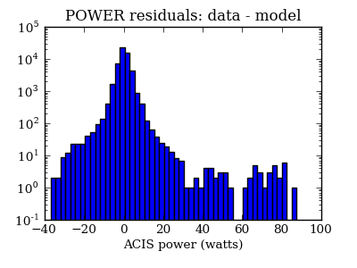
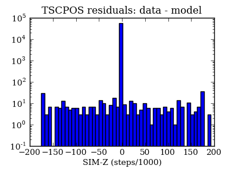

=======================
PSMC temperatures check
=======================
.. role:: red

Summary
--------         
.. class:: borderless

====================  =============================================
Date start            2009:361:23:27:00.000
Date stop             2010:011:03:01:45.385
1PDEAAT status        OK (limit = 52.5 C)
1PIN1AT status        OK (limit = 36.5 C)
Run time              Fri Jan  8 13:40:01 2010 by jeanconn
Run log               `<run.dat>`_
Temperatures          `<temperatures.dat>`_
States                `<states.dat>`_
====================  =============================================

No 1PDEAAT Violations

No 1PIN1AT Violations

=======================
PSMC Model Validation
=======================

MSID quantiles
---------------

.. csv-table:: 
   :header: "MSID", "1%", "5%", "16%", "50%", "84%", "95%", "99%"
   :widths: 15, 10, 10, 10, 10, 10, 10, 10

   1PDEAAT,-4.23,-2.80,-1.80,-0.18,2.01,3.55,5.86
   1PIN1AT,-4.19,-3.35,-1.80,-0.29,1.45,2.80,5.31
   AOSARES1,-2.412,-0.057,-0.006,0.076,0.153,0.216,2.746
   POWER,-8.36,-4.35,-2.21,-0.06,2.26,4.27,9.00
   TSCPOS,-1,-1,-1,0,0,1,1

Validation Violations
---------------------

.. csv-table:: 
   :header: "MSID", "Quantile", "Value", "Limit"
   :widths: 15, 10, 10, 10

   1PDEAAT,99,5.86,5.50
   AOSARES1,99,2.746,2.50

1PDEAAT
-----------------------
Red = telemetry, blue = model

1PIN1AT
-----------------------
Red = telemetry, blue = model

AOSARES1
-----------------------
Red = telemetry, blue = model

POWER
-----------------------
Red = telemetry, blue = model

TSCPOS
-----------------------
Red = telemetry, blue = model

