=======================
PSMC temperatures check
=======================
.. role:: red

Summary
--------         
.. class:: borderless

====================  =============================================
Date start            2008:307:12:54:26.141
Date stop             2008:315:10:06:38.024
1PDEAAT status        OK (limit = 52.5 C)
1PIN1AT status        OK (limit = 36.5 C)
Run time              Fri Jan  8 13:38:31 2010 by jeanconn
Run log               `<run.dat>`_
Temperatures          `<temperatures.dat>`_
States                `<states.dat>`_
====================  =============================================

No 1PDEAAT Violations

No 1PIN1AT Violations

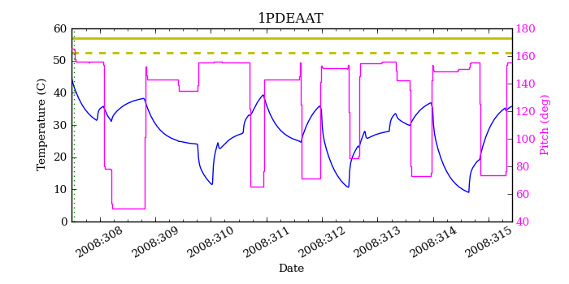
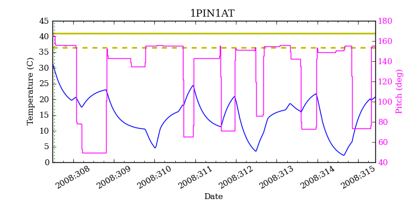
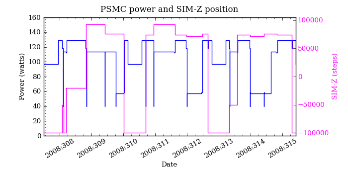

=======================
PSMC Model Validation
=======================

MSID quantiles
---------------

.. csv-table:: 
   :header: "MSID", "1%", "5%", "16%", "50%", "84%", "95%", "99%"
   :widths: 15, 10, 10, 10, 10, 10, 10, 10

   1PDEAAT,-2.15,-1.13,-0.01,1.51,3.90,5.26,6.28
   1PIN1AT,-3.73,-2.37,-1.14,0.71,2.85,3.82,5.01
   AOSARES1,-2.126,-0.132,-0.033,0.035,0.160,0.185,2.300
   POWER,-7.09,-3.40,-1.28,0.89,4.03,6.02,8.87
   TSCPOS,-1,-1,-1,0,0,0,0

Validation Violations
---------------------

.. csv-table:: 
   :header: "MSID", "Quantile", "Value", "Limit"
   :widths: 15, 10, 10, 10

   1PDEAAT,50,1.51,1.00
   1PDEAAT,99,6.28,5.50

1PDEAAT
-----------------------
Red = telemetry, blue = model

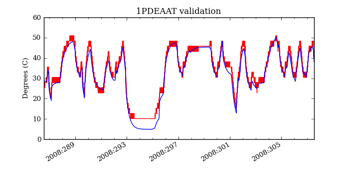
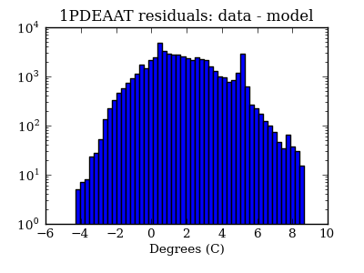
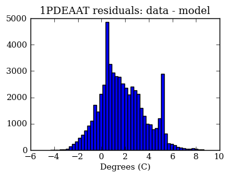

1PIN1AT
-----------------------
Red = telemetry, blue = model

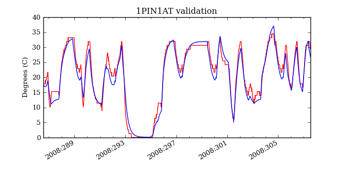
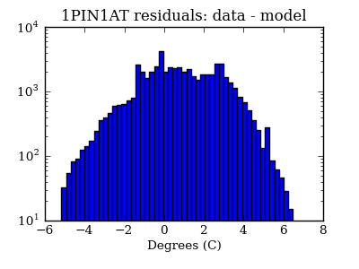
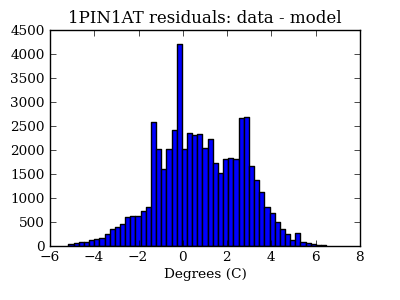

AOSARES1
-----------------------
Red = telemetry, blue = model

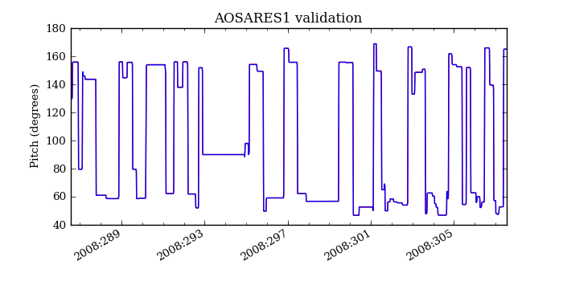
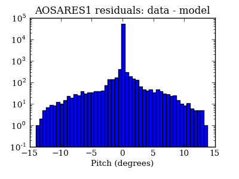
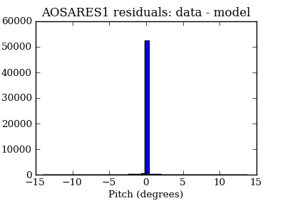

POWER
-----------------------
Red = telemetry, blue = model

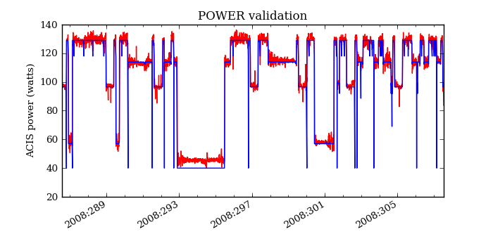
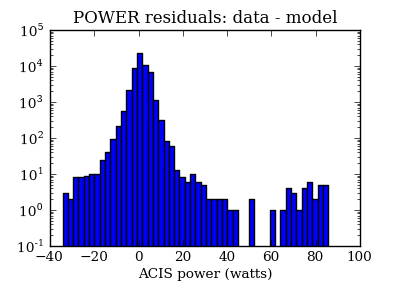
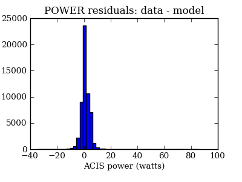

TSCPOS
-----------------------
Red = telemetry, blue = model

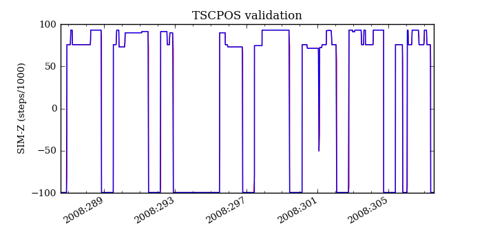
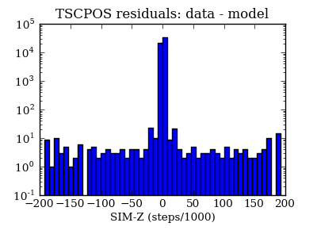
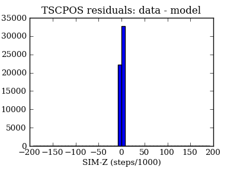

