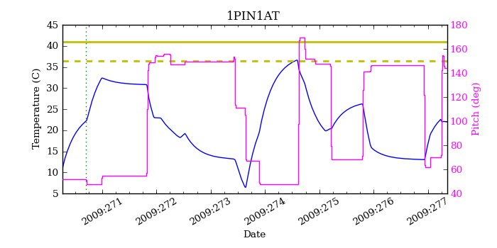
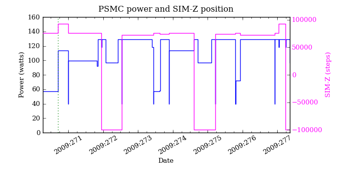
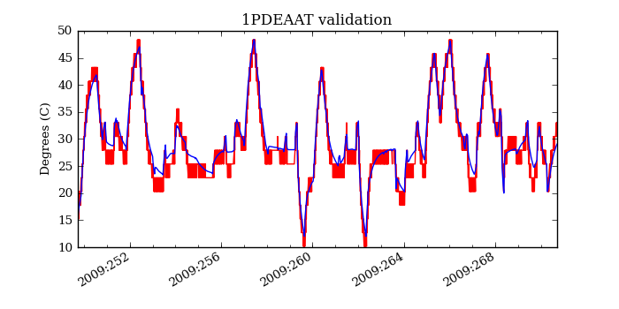
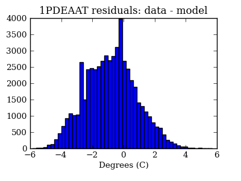
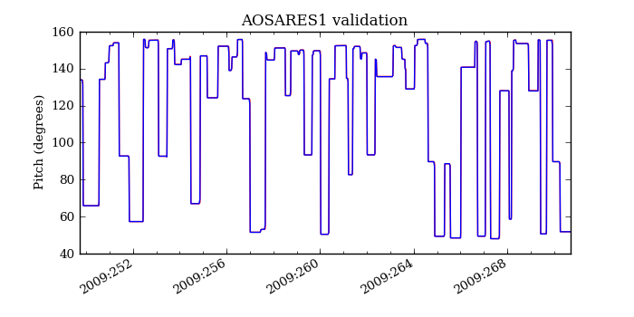
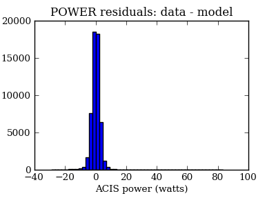
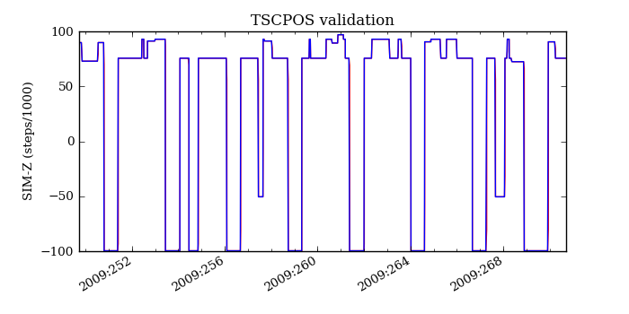
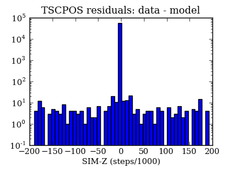

=======================
PSMC temperatures check
=======================
.. role:: red

Summary
--------         
.. class:: borderless

====================  =============================================
Date start            2009:270:16:53:50.536
Date stop             2009:277:08:37:52.372
1PDEAAT status        OK (limit = 52.5 C)
1PIN1AT status        :red:`NOT OK` (limit = 36.5 C)
Run time              Fri Jan  8 13:39:35 2010 by jeanconn
Run log               `<run.dat>`_
Temperatures          `<temperatures.dat>`_
States                `<states.dat>`_
====================  =============================================

No 1PDEAAT Violations

1PIN1AT Violations
-------------------
=====================  =====================  ==================
Date start             Date stop              Max temperature
=====================  =====================  ==================
2009:274:13:34:00.387  2009:274:14:25:56.387  36.69
=====================  =====================  ==================

.. image:: 1pdeaat.png

=======================
PSMC Model Validation
=======================

MSID quantiles
---------------

.. csv-table:: 
   :header: "MSID", "1%", "5%", "16%", "50%", "84%", "95%", "99%"
   :widths: 15, 10, 10, 10, 10, 10, 10, 10

   1PDEAAT,-4.26,-3.52,-2.54,-0.80,0.77,1.95,2.98
   1PIN1AT,-5.56,-3.77,-2.53,-0.70,1.01,1.67,2.55
   AOSARES1,-2.054,-0.068,-0.017,0.076,0.119,0.159,2.255
   POWER,-7.99,-4.04,-2.16,0.17,2.43,4.23,7.84
   TSCPOS,-1,-1,-1,0,0,1,1

Validation Violations
---------------------

.. csv-table:: 
   :header: "MSID", "Quantile", "Value", "Limit"
   :widths: 15, 10, 10, 10

   1PIN1AT,1,-5.56,5.50

1PDEAAT
-----------------------
Red = telemetry, blue = model

.. image:: 1pdeaat_valid_hist_log.png

1PIN1AT
-----------------------
Red = telemetry, blue = model

.. image:: 1pin1at_valid.png
.. image:: 1pin1at_valid_hist_log.png
.. image:: 1pin1at_valid_hist_lin.png

AOSARES1
-----------------------
Red = telemetry, blue = model

.. image:: aosares1_valid_hist_log.png
.. image:: aosares1_valid_hist_lin.png

POWER
-----------------------
Red = telemetry, blue = model

.. image:: power_valid.png
.. image:: power_valid_hist_log.png

TSCPOS
-----------------------
Red = telemetry, blue = model

.. image:: tscpos_valid_hist_lin.png

