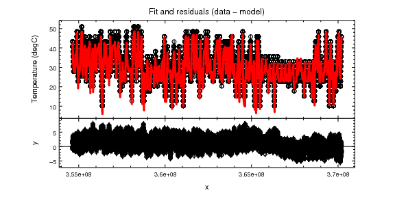
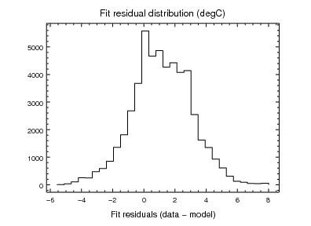
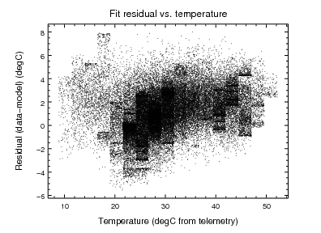
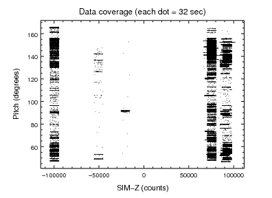
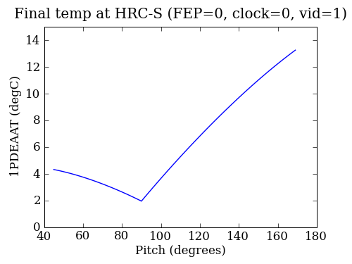

.. psmc documentation master file, created by

Chandra PSMC model tools
==================================

This suite of tools provides the tools to use and maintain the Chandra ACIS
PSMC model.  The key elements are:

  - ``psmc_check.py``: Thermal check of command loads and validate PSMC model against recent telemetry
  - ``psmc_calibrate.py``: Calibrate PSMC model coefficients
  - ``twodof.py``: Actual PSMC model code
  - ``characteristics.py``: Characteristics used in model evaluation

The PSMC tools depend on Sybase tables and in particular the commanded states database
which is accessed primarily via the Chandra.cmd_states_ module.

.. _Chandra.cmd_states: ../pydocs/Chandra.cmd_states.html

psmc_check
========================

Overview
-----------
This code generates backstop load review outputs for checking the ACIS
PSMC temperatures 1PIN1AT and 1PDEAAT.  It also generates PSMC model validation
plots comparing predicted values to telemetry for the previous three weeks.

Command line options
---------------------
===================== ====================================== ===================
Option                Description                            Default           
===================== ====================================== ===================
-h, --help            show this help message and exit                           
--outdir=OUTDIR       Output directory                       out         
--oflsdir=OFLSDIR     Load products OFLS directory           None               
--power=POWER         Starting PSMC power (watts)            From telemetry     
--simpos=SIMPOS       Starting SIM-Z position (steps)        From telemetry     
--pitch=PITCH         Starting pitch (deg)                   From telemetry     
--T_dea=T_DEA         Starting 1pdeaat temperature (degC)    From telemetry     
--T_pin=T_PIN         Starting 1pin1at temperature (degC)    From telemetry     
--dt=DT               Time step for model evaluation (sec)   32.8               
--days=DAYS           Days of validation data (days)         21                 
--traceback=TRACEBACK Enable tracebacks                      True
--verbose=VERBOSE     Verbosity (0=quiet, 1=normal, 2=debug) 1 (normal)
===================== ====================================== ===================

The model starting parameters (temperature and spacecraft state) can be
specified in one of two ways:

 - Provide all of the ``power``, ``simpos``, ``pitch``, ``T_dea``, and ``T_pin``
   command line options corresponding to the expected state at the
   load start time.  This may be necessary in the event of complex replan
   situations where the second option fails to capture the correct starting
   state.  In this case the ``cmd_states`` table is not used.

 - Provide none of the above command line options.  In this case the tool
   will propagate forward from a 5-minute average of the last available
   telemetry using the ``cmd_states`` table.  This table contains expected
   commanding from the approved command loads in the operations database.  This
   is the default usage.

Usage
--------

The typical way to use the load review tool =psmc_check.py= is via the script
launcher =/proj/sot/ska/bin/psmc_check=.  This script sets up the Ska runtime
environment to ensure access to the correct python libraries.  This must be run
on a 64-bit linux machine. Presently the OS should be Fedora Core 8; other
configurations may fail.

::

 /proj/sot/ska/bin/psmc_check --outdir=out --oflsdir=/data/mpcrit1/mplogs/2009/MAY1809/oflsb
 /proj/sot/ska/bin/psmc_check --simpos -99616 --ra 30 --dec 40 --roll 50 --T_dea 40 --T_pin 30 --power 80

psmc_calibrate.py
========================
Calibrate PSMC model coefficients using telemetry from specified time range.

::

  Usage: psmc_calibrate.py [options]

  Options:
    -h, --help            show this help message and exit
    --datestop=DATESTOP   Stop date for calibration dataset
    --ndays-acis=NDAYS_ACIS
                          Number of days for ACIS
    --ndays-hrc=NDAYS_HRC
                          Number of days for HRC
    --figroot=FIGROOT     Figure root name
    --fit                 Do fitting
    --no-fit              Do not do fitting

Current calibration plots
---------------------------
**Fit and residuals (data-model)**

Note: the drop around T=3.67e8 is believed to be due to turning off the FA6 heater 
near 2009:227.

**Fit residual histogram**

**Residuals (data-model) vs. temperature (telemetry)**

**Pitch vs. SIM-Z coverage**

**SCS 107 settling temperatures**

Update procedure
----------------
- Use the following commands from the shell to generate a new set of PSMC model
  parameters::

    svn checkout file:///proj/sot/ska/svn/psmc/trunk/predict predict
    cd predict
    ciao
    setenv PYTHONPATH /home/aldcroft/ciaopy/lib/python
    python psmc_calibrate.py | tee psmc_calibrate.log

- Compare parameters to existing values.  Watch for outliers and examine
  fit_pitch_simpos.png for coverage.  Note that this plot shows coverage
  for the ACIS time interval (typically 180 days) instead of the HRC
  interval (typically 360 days).

- Update the model_par definition from screen output or ``psmc_calibrate.log`` 
  and update the calibration ``VERSION`` in characteristics.py.

- Update project ``VERSION`` in ``Makefile``.

- Test the new characteristics file by running::

    /proj/sot/ska/bin/psmc_check --oflsdir <latest_ofls_dir> --outdir out_release
    python psmc_check.py --oflsdir <latest_ofls_dir> --outdir out_pre
    ./scs107_settling.py

  Ensure that results are sensible and that the ``VERSION`` matches expectation.

- Examine diffs then commit the changes::

    svn diff --diff-cmd tkdiff
    svn commit -m "Update model calibration with data through <stopdate>: version <VERSION>"

- Obtain review approval at the load review, install new files, and test::

    make docs
    make dist
    make install
    /proj/sot/ska/bin/psmc_check --oflsdir <latest_ofls_dir> --outdir out_post

  Make sure that ``out_post`` and ``out_pre`` results are identical.

Tools
====================

.. toctree::
   :maxdepth: 2

   psmc_check
   twodof

