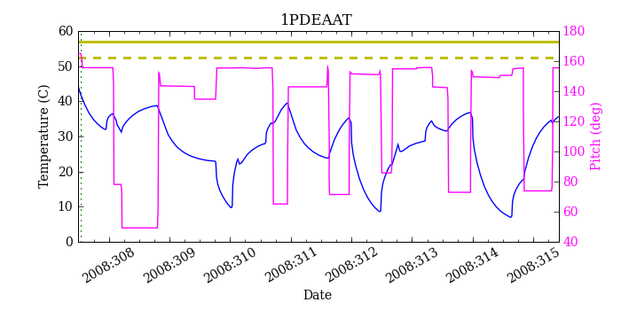
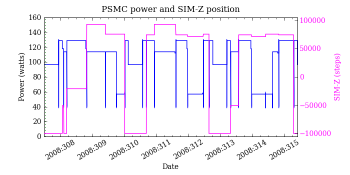
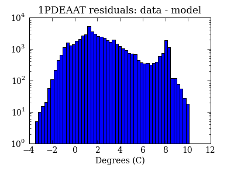
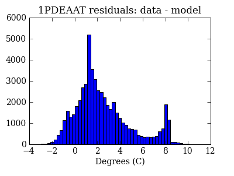
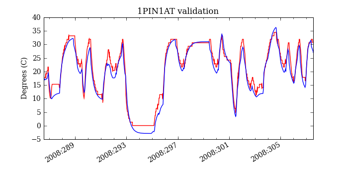
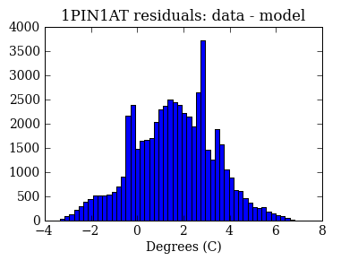
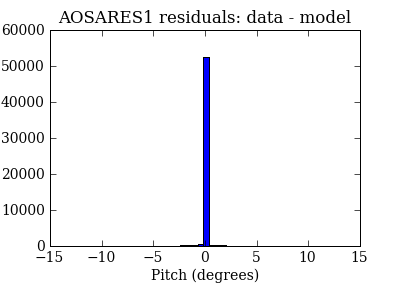

=======================
PSMC temperatures check
=======================
.. role:: red

Summary
--------         
.. class:: borderless

====================  =============================================
Date start            2008:307:12:54:26.141
Date stop             2008:315:10:06:38.024
1PDEAAT status        OK (limit = 52.5 C)
1PIN1AT status        OK (limit = 36.5 C)
Run time              Tue Oct 13 11:48:21 2009 by jeanconn
Run log               `<run.dat>`_
Temperatures          `<temperatures.dat>`_
States                `<states.dat>`_
====================  =============================================

No 1PDEAAT Violations

No 1PIN1AT Violations

.. image:: 1pin1at.png

=======================
PSMC Model Validation
=======================

MSID quantiles
---------------

.. csv-table:: 
   :header: "MSID", "1%", "5%", "16%", "50%", "84%", "95%", "99%"
   :widths: 15, 10, 10, 10, 10, 10, 10, 10

   1PDEAAT,-1.49,-0.76,0.32,1.89,4.92,8.08,8.21
   1PIN1AT,-2.49,-1.47,-0.26,1.64,3.35,4.39,5.61
   AOSARES1,-2.126,-0.132,-0.033,0.035,0.160,0.185,2.300
   POWER,-7.09,-3.40,-1.28,0.89,4.03,6.02,8.87
   TSCPOS,-1,-1,-1,0,0,0,0

Validation Violations
---------------------

.. csv-table:: 
   :header: "MSID", "Quantile", "Value", "Limit"
   :widths: 15, 10, 10, 10

   1PDEAAT,50,1.89,1.00
   1PDEAAT,99,8.21,5.50
   1PIN1AT,99,5.61,5.50

1PDEAAT
-----------------------
Red = telemetry, blue = model

.. image:: 1pdeaat_valid.png

1PIN1AT
-----------------------
Red = telemetry, blue = model

.. image:: 1pin1at_valid_hist_log.png

AOSARES1
-----------------------
Red = telemetry, blue = model

.. image:: aosares1_valid.png
.. image:: aosares1_valid_hist_log.png

POWER
-----------------------
Red = telemetry, blue = model

.. image:: power_valid.png
.. image:: power_valid_hist_log.png
.. image:: power_valid_hist_lin.png

TSCPOS
-----------------------
Red = telemetry, blue = model

.. image:: tscpos_valid.png
.. image:: tscpos_valid_hist_log.png
.. image:: tscpos_valid_hist_lin.png

