=======================
PSMC temperatures check
=======================
.. role:: red

Summary
--------         
.. class:: borderless

====================  =============================================
Date start            2008:363:21:33:33.441
Date stop             2009:012:01:07:07.280
1PDEAAT status        OK (limit = 52.5 C)
1PIN1AT status        OK (limit = 36.5 C)
Run time              Mon Oct  5 17:39:36 2009 by jeanconn
Run log               `<run.dat>`_
Temperatures          `<temperatures.dat>`_
States                `<states.dat>`_
====================  =============================================

No 1PDEAAT Violations

No 1PIN1AT Violations

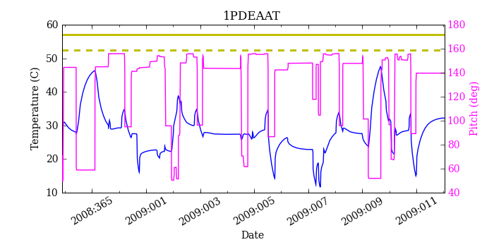
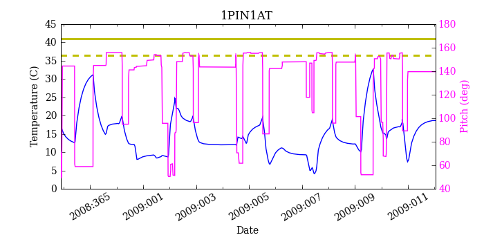
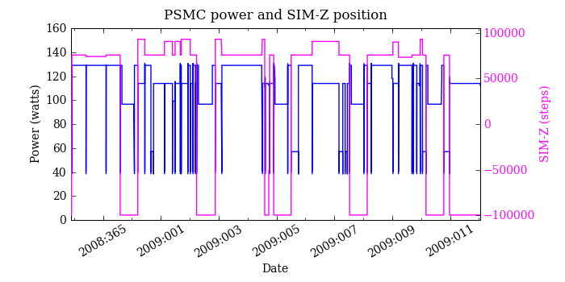

=======================
PSMC Model Validation
=======================

MSID quantiles
---------------

.. csv-table:: 
   :header: "MSID", "1%", "5%", "16%", "50%", "84%", "95%", "99%"
   :widths: 15, 10, 10, 10, 10, 10, 10, 10

   1PDEAAT,-1.46,-0.59,0.30,1.63,2.98,3.89,4.79
   1PIN1AT,-1.25,-0.35,0.25,1.48,2.88,3.75,4.59
   AOSARES1,-2.407,-0.098,-0.046,0.005,0.103,0.177,2.560
   POWER,-6.06,-3.14,-1.36,0.59,2.55,4.20,7.30
   TSCPOS,-1,-1,-1,0,0,1,1

Validation Violations
---------------------

.. csv-table:: 
   :header: "MSID", "Quantile", "Value", "Limit"
   :widths: 15, 10, 10, 10

   1PDEAAT,50,1.63,1.00

1PDEAAT
-----------------------
Red = telemetry, blue = model

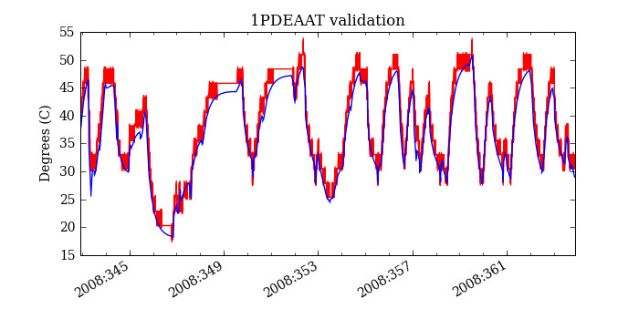
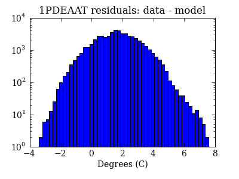
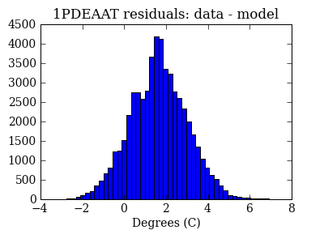

1PIN1AT
-----------------------
Red = telemetry, blue = model

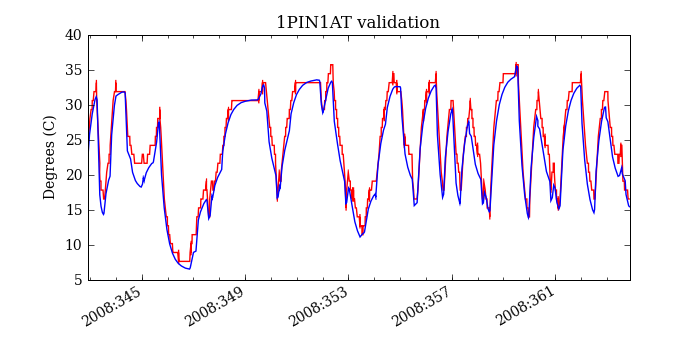
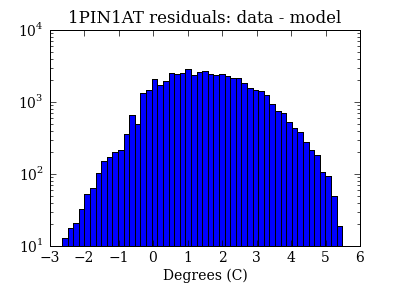
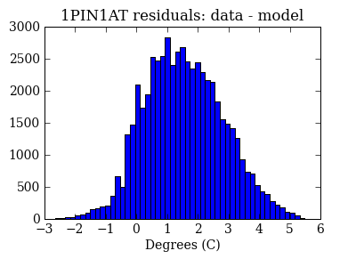

AOSARES1
-----------------------
Red = telemetry, blue = model

.. image:: aosares1_valid.png
.. image:: aosares1_valid_hist_log.png
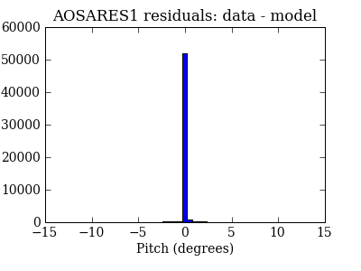

POWER
-----------------------
Red = telemetry, blue = model

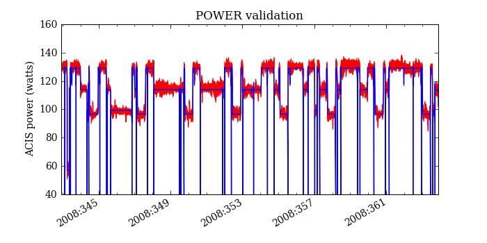
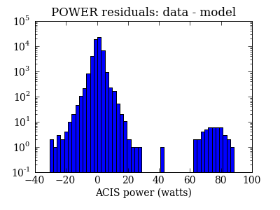
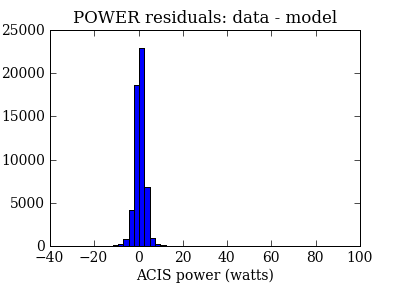

TSCPOS
-----------------------
Red = telemetry, blue = model

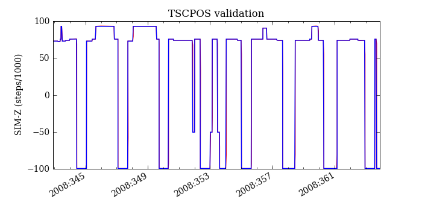
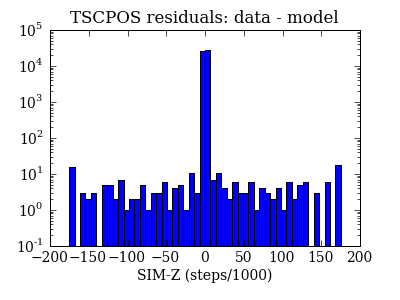
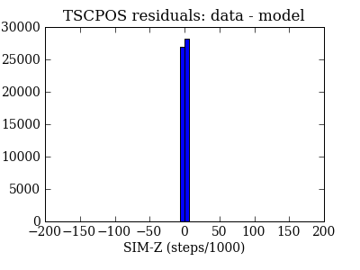

