=======================
PSMC temperatures check
=======================
.. role:: red

Summary
--------         
.. class:: borderless

====================  =============================================
Date start            2009:270:16:53:50.536
Date stop             2009:277:08:37:52.372
1PDEAAT status        OK (limit = 52.5 C)
1PIN1AT status        OK (limit = 36.5 C)
Run time              Tue Oct  6 18:44:54 2009 by jeanconn
Run log               `<run.dat>`_
Temperatures          `<temperatures.dat>`_
States                `<states.dat>`_
====================  =============================================

No 1PDEAAT Violations

No 1PIN1AT Violations

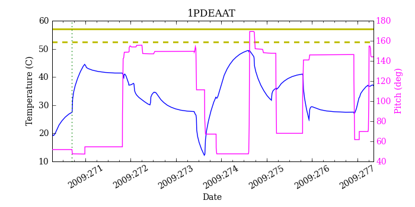
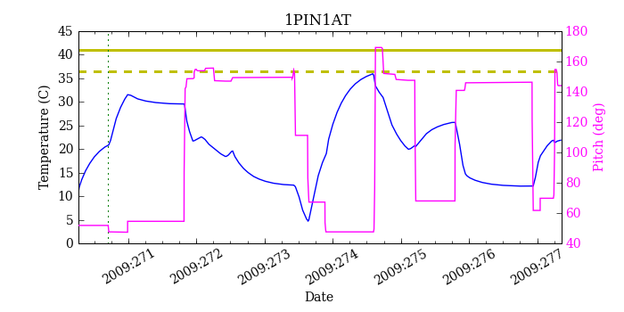
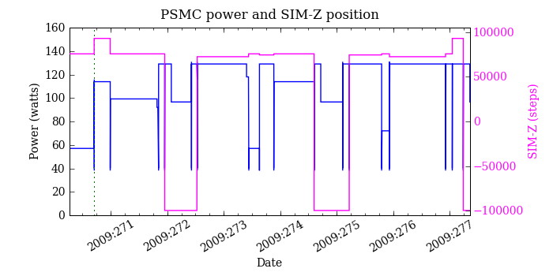

=======================
PSMC Model Validation
=======================

MSID quantiles
---------------

.. csv-table:: 
   :header: "MSID", "1%", "5%", "16%", "50%", "84%", "95%", "99%"
   :widths: 15, 10, 10, 10, 10, 10, 10, 10

   1PDEAAT,-4.29,-3.24,-2.26,-0.31,1.32,2.54,3.62
   1PIN1AT,-4.40,-3.24,-2.07,-0.33,1.78,2.47,3.29
   AOSARES1,-2.054,-0.068,-0.017,0.076,0.119,0.159,2.255
   POWER,-7.99,-4.04,-2.16,0.17,2.43,4.23,7.84
   TSCPOS,-1,-1,-1,0,0,1,1

No Validation Violations

1PDEAAT
-----------------------
Red = telemetry, blue = model

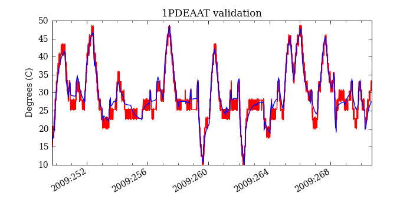
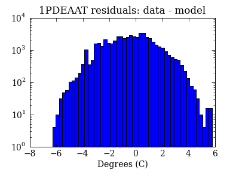
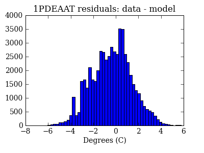

1PIN1AT
-----------------------
Red = telemetry, blue = model

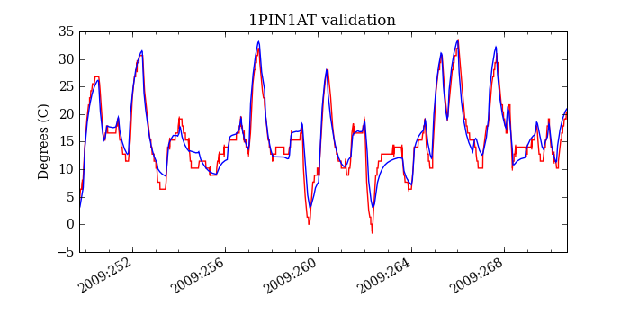
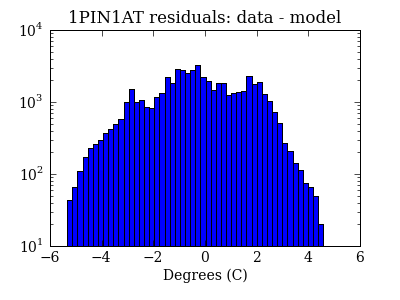
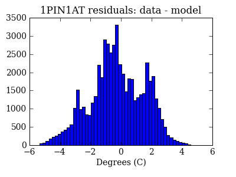

AOSARES1
-----------------------
Red = telemetry, blue = model

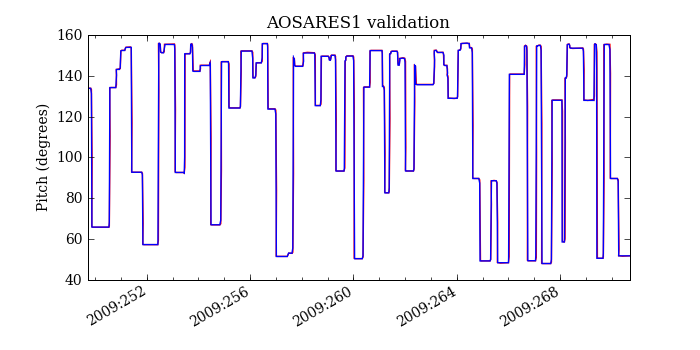
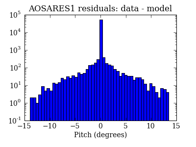
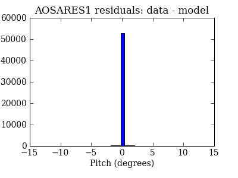

POWER
-----------------------
Red = telemetry, blue = model

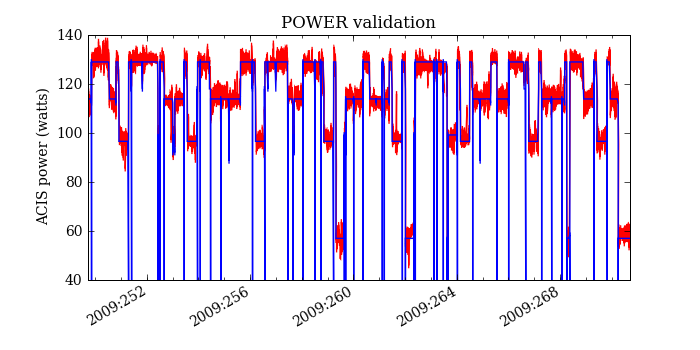
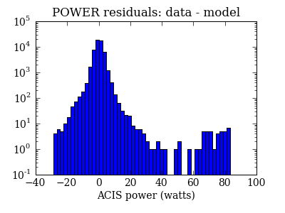
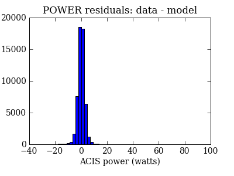

TSCPOS
-----------------------
Red = telemetry, blue = model

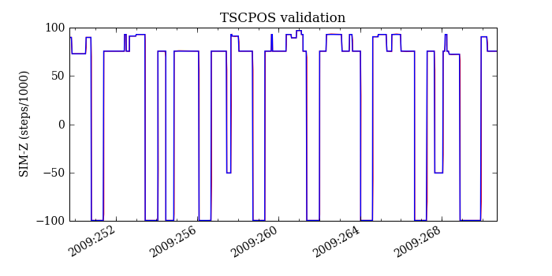
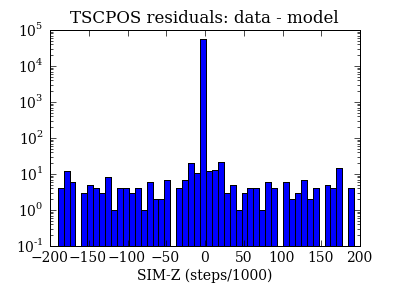
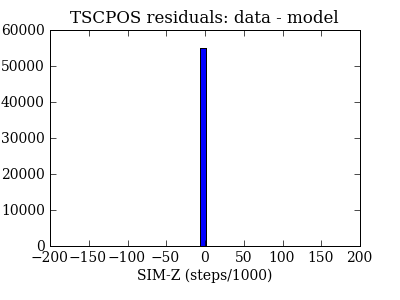

